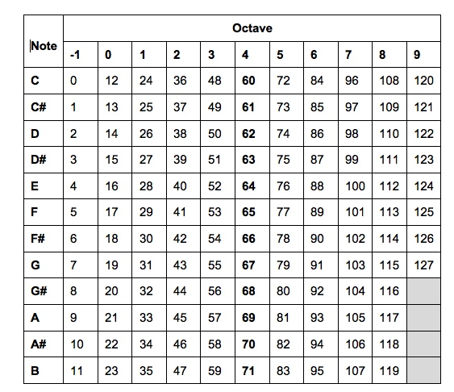
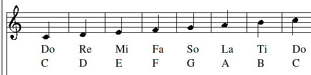
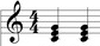
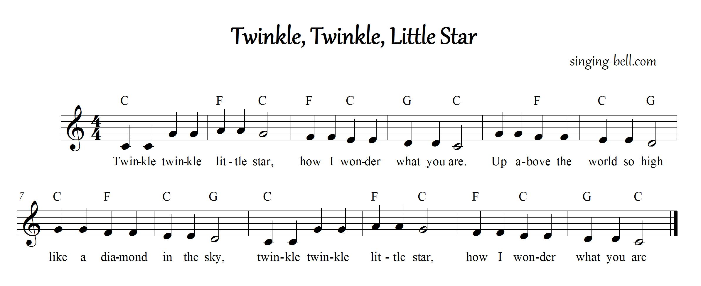

Twinkle Little Star - Making Sounds with Overtone
=================================================

This is a story of Meg who attended a ClojureBridge workshop
recently.  Meg has always been a bit of a music nerd, but wondered
why DJs always used laptops on stage. Then she saw a live music
coding video, and read that they use Clojure to create the
music. Intrigued, she started to investigate Overtone.

[Overtone](http://overtone.github.io) is a way to generate sounds,
instruments and music using Clojure. While it is very advanced, it is
pretty easy to get started, and interesting to explore.


1. Prelude - getting started
----------------------------

### Download the project

Meg has already learned ClojureBridge has a template project for
Overtone. The first thing to get started is to *clone out* that
project using `git` command.

Meg opened the terminal and typed the command:

```bash
git clone https://github.com/ClojureBridge/tones.git
```

> (Option) It's a good practice to start from creating a Clojure
> project. [Starting from scratch](00-starting-from-scratch.md)
> explains how to do that. Try it later.

### Evaluate the file

Soon, `git` command downloaded the project, so Meg started Light Table
and opened the file `tones/src/tones/play.clj`
Next, she evaluated `play.clj` by hitting
<kbd>Cmd</kbd> + <kbd>Shift</kbd> + <kbd>Enter</kbd>
(or <kbd>Ctrl</kbd> + <kbd>Shift</kbd> + <kbd>Enter</kbd>),
which took a while to finish.

When it completed, hey listen, music!
Familiar melody of "Twinkle Little Star" came out from Meg's computer.

Meg moved the cursor right next to `(twinkle)` and evaluated this line
by hitting
<kbd>Cmd</kbd> + <kbd>Enter</kbd>
(or <kbd>Ctrl</kbd> + <kbd>Enter</kbd>).
Again, she heard the music. It was the first part of "Twinkle Little
Star" played by a piano.

> On `lein repl`, start up repl at the top tones directory.
> Next, `(require 'tones.play)`, which loads and evaluates the file.
> You should hear a melody once the file evaluation finishes.
> To listen the melody again, change the namespace by typing
> `(ns tones.play)`, then `(twinkle)`.

### What to look at

Although the music was childish, naive one, it was enough to make Meg
very excited.
Immediately, Meg went to the Overtone github repository on the
browser, https://github.com/overtone/overtone, and looked around the
repository.
She found many examples there. Among those, these two looked helpful
to make piano sounds.

* https://github.com/overtone/overtone/blob/master/src/overtone/examples/getting_started/pragpub-article.clj
* https://github.com/overtone/overtone/blob/master/src/overtone/examples/workshops/resonate2013/ex01_phrasestudy.clj


2. Etude - Playing Piano Notes
------------------------------

#### basic `piano` function usage

Meg started using Overtone functions.
The first function she tried was `piano` without any argument, very
basic one.
Meg typed the function below in the file, `play.clj`:

```clojure
(piano)
```

then, evaluated this line. Yes! She heard a piano note from her
computer. Meg evaluate this simple function a couple of times with joy.

> If you didn't heard anything, check the volume.
> you did turn up the volume, right?

### `piano` function argument

Meg has already learned `piano` function takes a note number as an
argument. For example:

```clojure
(piano 48)
```

The `48` is the number that corresponds to the note.
However, just numbers were bit hard to figure out what note she made.
Actually she has heard musicians are used to notes, not numbers,
so they want to write notes instead of number as the argument.
Meg found a nice Overtone converter function, `note`.

When Meg used the function like this:

```clojure
(note :c3)
```

it returned `48`, so the value of `:c3` is `48`.

Before randomly try various notes, Meg googled to find the
correspondence between numbers and notes. Soon, she found many.
For example,




from [Understanding musical theory](http://wiki.spheredev.org/Understanding_musical_theory)

Looking at the chart, Meg understood `:c3` expressed a `C` note in the third octave starting
from zero octave. Now, she could make a piano note like this:

```clojure
(piano (note :c3))
```


### `chord` function

While googling, Meg noticed that there were the sound called
a *chord*, a mixture of a couple of notes, like this:



Meg realized that Overtone's `chord` function was a handy chords
generator, which returns three numbers of the chord.
Too see how to use `chord` function, Meg looked at the document.
She moved the cursor right next to the function name *chord*,
right clicked and selected "show docs".

> On repl, `(doc chord)`


```clojure
overtone.live
([root chord-name] [root chord-name inversion])
Returns a set of notes for the specified chord. The root must be in
  midi note format i.e. :C4.

  (chord :c4 :major)  ; c major           -> #{60 64 67}
  (chord :a4 :minor)  ; a minor           -> #{57 60 64}
  (chord :Bb4 :dim)   ; b flat diminished -> #{70 73 76}
```

Meg talked to herself, "ah, that's why a function call"

```clojure
(chord :c3 :major)
```

"returned"
```clojure
(48 55 52)
```

"these three, got it."

She completely understood the `chord` function, its meaning and how to use.
However, the problem was how to make the piano sound of
`(chord :c3 :major)`.
She typed `(piano 48) (piano 55) (piano 52)` in the same line and
evaluated the line, but the sounds was a single note.

> On repl, writing `(piano 48) (piano 55) (piano 52)` in a single line
> works and makes a chord sound. But unfortunately, this doesn't work
> on Light Table.

Meg thought a while, thinking what she learned at ClojureBridge
workshop. Suddenly, the idea came up on her mind, "write a function!"
Soon, she wrote a function, `c3-major-chord` in `play.clj` file:

```clojure
;; function definition
(defn c3-major-chord
  []
  (piano 48)
  (piano 55)
  (piano 52))
```

At the last line of the function, she evaluated it.
Then, wrote another line of code to use this function.

```clojure
;; usage
(c3-major-chord)
```

On the right end of this line, she evaluated it also.
Hey! a piano chord! Meg heard the sound of a chord not a single note.


### sequence of notes

Meg looked at her function with satisfaction for a while.
At first, it looked nice, but a repetition of the same function made
her think, "is there any better way to do this?"

She went to ClojureBridge curriculum site on the browser,
http://clojurebridge.github.io/curriculum/#/ ,
then realized,
"Icky. This is Clojure. It is very good at
*iterate* over a a *sequence*."
In this case, `doseq` function fits well, which she learned at
ClojureBridge main curriculum. 

Since `chord` function returns a sequence of numbers,
the repetition should be replaced by:

```clojure
(doseq [note (chord :c3 :major)]  ;; Sequence
  (piano note))                   ;; Behavior
```

The `doseq` assigns the `note` variable the value of the first note,
and then calls `(piano note)` to play it. It then assigns the second
value from our `chord` function to `note`, and calls `(piano note)`
again.

When Meg evaluated this `doseq`, she could hear the same chord
as three piano functions.


### writing a function that takes arguments

At first, Meg rewrote the `c3-major-code` function just replacing
the repetition by the `doseq`:

```clojure
;; function definition
(defn c3-major-chord
  []
  (doseq [note (chord :c3 :major)]
    (piano note))
```

Again, looking at the function, she thought how to make this function
more general. That's because the function can make only c3 major
chord, but a bunch of other chords are out there... a bunch of functions for
each chord didn't make sense.
"Ha, ha! I should change the function so that it will take arguments," she shouted and smiled.

Since the `chord` function takes two arguments, root and chord-name,
the function needs two arguments, also.
Now, the function got another name, `piano-chord`, as it went to more
general:

```clojure
;; function definition
(defn piano-chord [root chord-name]
  (doseq [note (chord root chord-name)]
    (piano note)))
```

Next, she wrote lines of code to use it.

```clojure
;; usage
(piano-chord :c3 :minor)
(piano-chord :e2 :major)
```

Her feeling was quite happy when she evaluated the function and these lines one by one.

### [BONUS] change the function to take multiple sets of arguments

Well, she didn't stop looking at this brand new function
`piano-chord` since the `chord` can take the third argument,
an `inversion` parameter, which is optional to the `chord`.
Given that, the `piano-chord` should let her have this sort of
*alternate* behavior.

Clojure has a way to define multiple
*behavior* based on how many parameters are given.
Using this feature, `piano-chord` function became like this:

```clojure
(defn piano-chord
  ([root chord-name]
    (doseq [note (chord root chord-name)]
      (piano note)))
  ([root chord-name inv]
    (doseq [note (chord root chord-name inv)]
      (piano note))))
```

The `piano-chord` function definition got two body entries,
where the first element of each is a vector of the
parameters. Based on the number of parameters, 2 or 3, either the
first or second line is executed.

If this gets evaluated:

```clojure
(piano-chord :c3 :minor)
```

the first body entry will be used. When the arguments are three:

```clojure
(piano-chord :c1 :dim 4)
```

the second body is called. This is a *seriously* moody chord.
There're a lot of chords, for example, this also:

```clojure
(piano-chord :g3 :dom7)
```


### make a melody

So far, Meg enjoyed making piano notes or chords.
It was absolutely fun, but she wondered how to make a melody.
When the `twinkle` function in `play.clj` file got evaluated, it
played the melody of Twinkle Little Star. She wanted to do something
like that. Among Overtone documents and examples, she found that
the answer was to introduce a *progression* by `at` function.

The idea of *progression* is by setting time differences to successive
notes or chords, for example, note1 at now, note2 at 1 second later,
note3 at 2 seconds later, and so on, shifts the time to play each
sound. This is why `at` function takes time for its first argument.

Meg used `at` function and wrote this:

```clojure
(let [time (now)]
  (at         time  (piano-chord :d4 :minor7))
  (at (+ 2000 time) (piano-chord :g3 :major7))
  (at (+ 4000 time) (piano-chord :c3 :major7))
  (at (+ 6000 time) (piano-chord :e3 :minor7)))
```

She used `let` binding, which she learned at ClojureBridge main
curriculum, Functions module. With `let` binding, time holds the
current time (the time you hit the ctrl/cmd + space), which is
the return value of `now` function.
The `now` function returns the value of the current time in
*milliseconds*. ( 1 second = 1000 milliseconds)

The code above works like this:

1. play piano chord of :d4 :minor7 now
2. play piano chord of :g3 :major7 2 seconds later from now
3. play piano chord of :c3 :major7 4 seconds later from now
4. play piano chord of :e3 :minor7 6 seconds later from now

In another words, four piano chords are *scheduled* to play every 2
seconds. Overtone takes care of this scheduling stuff.

Meg changed the parameters a bit like this:

```clojure
(let [time (now)]
  (at         time  (piano-chord :c4 :minor))
  (at (+ 3000 time) (piano-chord :g3 :dom7))
  (at (+ 4000 time) (piano-chord :f3 :minor))
  (at (+ 7000 time) (piano-chord :g3 :dom7))
  (at (+ 8000 time) (piano-chord :c4 :minor)))
```

Hey, this sounds like really music!


### complete Twinkle Little Star

Meg recalled, `twinkle` function played only the first part of Twinkle Little
Start. She decided to add next part. That would be a nice exercise.
She googled and found the score of this well-known lullaby.



"OK, so I already have the melody from the beginning to 'what you
are'. If I add only 'Up above the world so high', next is the
repetition of the same phrase. The last is the repetition of the first
part," Meg thought.

What she needed to code was to play notes of `:g3 :g3 :f3 :f3 :e3 :e3 :d3`,
and stick functions together that she learned so far. Tested a couple
of small code for a while, she wrote the function `middle-melody` like this:

```clojure
;; notes of the middle phrase
(def phrase [:g3 :g3 :f3 :f3 :e3 :e3 :d3])

;; function definition
(defn middle-melody
  [start]
  (let [step 650
        notes phrase]
    (dotimes [i (count notes)]
      (at (+ start (* i step)) (piano (note (nth notes i)))))))
```

The function, `middle-melody`, takes a start time so that the successive
repetition can start after a certain delay.
She chose [`dotimes`](http://clojuredocs.org/clojure.core/dotimes)
function among a couple of other choices to looping the `at`
with its arguments. `nth` is the function she learned at ClojureBridge
main curriculum, Data Structures module.
Also, she tried some step variations to find a good interval between notes.

Meg tested the function she just wrote:

```clojure
(middle-melody (now))
```

It sounded good. The last piece was to play all, `twinkle`,
`middle-melody`, `middle-melody`, then `twinkle` in order.

```clojure
(let [start (now)]
  (twinkle start)
  (middle-melody (+ start 11000))
  (middle-melody (+ start 16500))
  (twinkle (+ start 22000)))
```

When Meg evaluated this `let` form at the end of line,
yes! it was a whole Twinkle Little Star by piano.
Meg was satisfied with the melody she created on her computer.


4. Finale - Epilogue
---------------------

Whew. This lessen covered a lot of ground including a bit about Overtone's
interface to SuperCollider music synthesis engine and how to use it.

It's really hard to imagine creating a song like this way, in another
words, this amount of typing. Probably, the work would require a
serious editor to keep our fingers from getting bloody.
Clojure should be all about *succinctness*, however, let’s leave this
for now and look at other useful ways to make music.

If you are interested in playing realistic sounds, look at
[this essay and code](http://blog.josephwilk.net/clojure/creating-instruments-with-overtone.html)
for building up an ethereal-sounding flute solo.
If you want to know making music without typing so much
like this lessen, check out the
[Leipzig Library](https://github.com/ctford/leipzig),
which explains how to build this sort of music compositions easier.

Have fun with making sounds!
